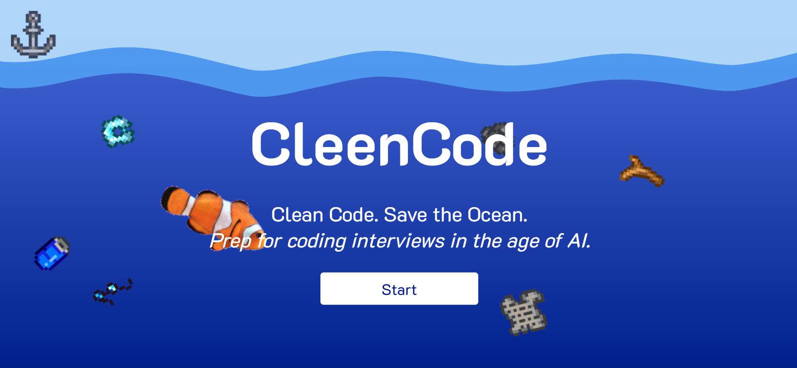

# CleenCode

CleenCode is a website for CS students to practice for technical interviews by correcting faulty code. 

It was submitted for WHACK 2025.

## Authors
* Nina Howley '27
* Dianna Gonzalez '27
* Jessica Chen '28
* Cindy Li '28

<h3><a href="https://cleencode.fishing/" target="_blank">Website</a></h3>
<h3><a href="https://devpost.com/software/cleencode?ref_content=user-portfolio&ref_feature=in_progress" target="_blank">Devpost</a></h3>
<h3><a href="https://docs.google.com/presentation/d/1Pj-qZoz-9NRz9xjVkWMByr6ymnSsAppOhB1rLHORHPM/present?slide=id.p" target="_blank">Presentation</a></h3>

### Landing Page



## Test Local Edits

1. **Clone the repository**
    ```
    git clone https://github.com/ninahowley/cleencode.git
    ```
2. **Install flask**
    ```
    pip install flask
    ```
3. **Run the app!**

   Mac: ```flask --app app run```

   Windows: ```python app.py```

## Tech Stack
+ **Frontend:** Flask, HTMl, CSS, JavaScript
+ **Backend:** Python and Pandas
